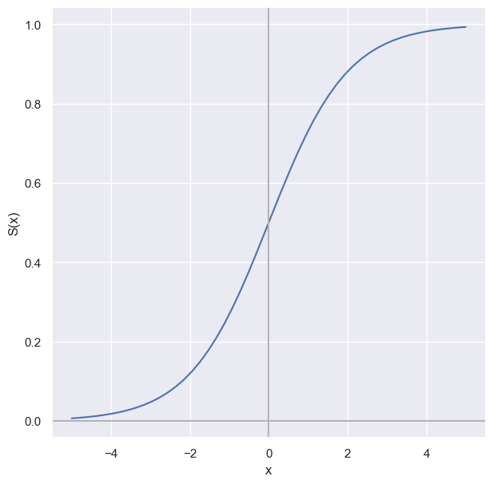

# Logistic Regression Model
Build a simple logistic regression model from scratch and test it with a binary classification task. The key idea is to generalize the linear regression result to a classification model by finding a <b>link</b> function $g$ that bridge linear regression to probabilistic values.

$$ g(P(y=i)) = \sum_{i=0}^{n}\beta_ix_i $$

One way to do so is to find a smooth and well-shaped function that maps $(-\infty, \infty)$ to $(0, 1)$, which we call it the <b>sigmoid</b> function:

$$S(x) = \frac{1}{1+e^{-y}} = p \qquad \text{where} \enspace  y = \sum\limits_{i=0}^{n}\beta_ix_i\$$

  

Three functions that are required to build:
1. A predict function (Applying sigmoid)
2. A cost function (To evaluate the result of the predict function)
3. A gradient descent alogrithm (To improve the weight)

## Data
Iris dataset: https://scikit-learn.org/stable/auto_examples/datasets/plot_iris_dataset.html

## Results
Achieved an accuracy of 1.0

## Conclusions
The model works well on a simple binary classification task. It is sensible to test on a more complicatd dataset and extend it to a multi-class classificaiton model. More features such as regularisation and feature scaling can be added.

## Software and Libraries
- Python 3.9
- NumPy
- Pandas
- Scikit-learn
- Matplotlib
- Jupyter Notebook
